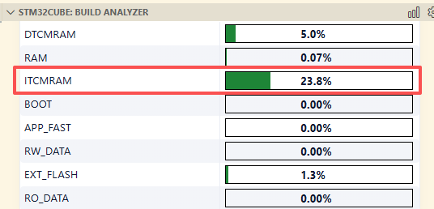
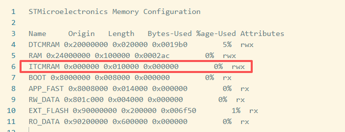

# STM32H7_Arm2D


### Memory Map

```Plaintext
	 Address          Memory Structure (Size)                  		Detail Partition               Address
  [0xFFFFFFFF] +---------------------------------------+---------------------------------------+
               |                                       |									   |
  0x9080_0000  +---------------------------------------+---------------------------------------+ 0x9080_0000
               |                                       |         Read_Only_Data (6144K)        |
               |         External_FLASH (8192K)        +---------------------------------------+ 0x9020_0000
               |                                       |           Application (2048K)         |
  0x9000_0000  +---------------------------------------+---------------------------------------+ 0x9000_0000
               |            Reserved/Unused            |            Reserved/Unused            |
  0x2410_0000  +---------------------------------------+---------------------------------------+
               |             AXI_SRAM3 (384K)          |									   |
  0x240A_0000  +---------------------------------------+---------------------------------------+
               |             AXI_SRAM2 (384K)          |									   |
  0x2404_0000  +---------------------------------------+---------------------------------------+
               |             AXI_SRAM1 (256K)          |									   |
  0x2400_0000  +---------------------------------------+---------------------------------------+
               |                Reserved               |                                       |
  0x2002_0000  +---------------------------------------+---------------------------------------+
               |             DTCM_RAM (128K)           |                                       |
  0x2000_0000  +---------------------------------------+---------------------------------------+
               |                Reserved               |									   |
  0x1FF2_0000  +---------------------------------------+---------------------------------------+
               |            System_RAM (128K)          |									   |
  0x1FF0_0000  +---------------------------------------+---------------------------------------+
               |                Reserved               |									   |
  0x0802_0000  +---------------------------------------+---------------------------------------+ 0x0802_0000
               |                                       |          Read_Write_Data (16K)        |
               |                                       +---------------------------------------+ 0x0801_C000
               |         Internal_FLASH (128K)         |          App_Fast_Code (80K)          |
               |                                       +---------------------------------------+ 0x0800_8000
               |                                       |               Boot (32K)              |
  0x0800_0000  +---------------------------------------+---------------------------------------+ 0x0800_0000
               |                Reserved               |									   |
  0x0001_0000  +---------------------------------------+---------------------------------------+
               |              ITCM_RAM (64K)           |									   |
  0x0000_0000  +---------------------------------------+---------------------------------------+
```


### COPY VECTOR TABLE TO SRAM

```ld
  /* The startup code goes first into FLASH */
    /* used by the startup to initialize vector table */
  _sivtor = LOADADDR(.isr_vector);
  .isr_vector :
  {
    . = ALIGN(4);
    _svtor = .;
    KEEP(*(.isr_vector)) /* Startup code */
    . = ALIGN(4);
    _evtor = .; 
  } >RAM AT> EXT_FLASH
```


```assembly
/* Copy the vector segment from flash to SRAM */
  ldr r0, =_svtor
  ldr r1, =_evtor
  ldr r2, =_sivtor
  movs r3, #0 
  b LoopCopyVtorInit

CopyVtorInit:
  ldr r4, [r2, r3]
  str r4, [r0, r3]
  adds r3, r3, #4
    
LoopCopyVtorInit:
  adds r4, r0, r3
  cmp r4, r1
  bcc CopyVtorInit
```


# DMA2D

`480*800*2 = 768000 `~750KB

RAM split two part, last 768KB use as GRAM.(AXI_SRAM2 & AXI_SRAM3)

RAM (xrw)           : ORIGIN = 0x24000000, LENGTH = 256K
GRAM (xrw)          : ORIGIN = 0x24040000, LENGTH = 768K


# Problems

1. `.ARM.exidx` limit range in ± 1G， limit place code in internal flash(0x0800_8000) and external flash(0x9000_0000).

   ```shell
   [build] ld.lld: error: <internal>:(.ARM.exidx+0x8): relocation R_ARM_PREL31 out of range: 1811987350 is not in [-1073741824, 1073741823]
   ```

   **Solution**

   discard in link file, maybe not a good idea(**I'm not familiar with this**). then we can place codes in internal flash when it need fast speed.

   ```ld
     /DISCARD/ :
     {
       libc.a:* ( * )
       libm.a:* ( * )
       libgcc.a:* ( * )
       *(.ARM.exidx*)   /* Remove ARM exception unwinding index table */
       *(.ARM.extab*)   /* Remove ARM exception unwinding instructions */
     }
   ```

   


# Bugs

1. In the VSCode STM32Cube Build Analyzer (v1.1.0) extension, there appear to be display errors regarding the **ITCM section** (address 0x0000_0000). The extension includes sections such as `.ARM.attributes` and `.symtab` in its usage calculation **which should be excluded**, leading to a reported usage higher than the actual amount. However, the ITCM section usage is **correctly reflected** in the `.map` file.

   

2. LCD screen abnormalities

   The output speed of the pins used by the LTDC must be configured to **Very High**; otherwise, screen corruption may occur after a period of operation.


# TODOS

- [x] External flash loader

- [x] boot

- [ ] application
  - [x] Uart async ring buffer
    - [x] Transmit use software ring buffer
  
    - [x] Receive use DMA circular mode
  
  - [x] Button
  
  - [ ] ~~LEDs control~~
  
  - [ ] ARM2D
  
  - [ ] 
  


