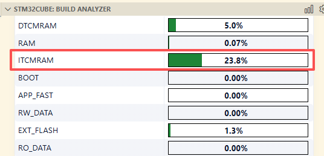
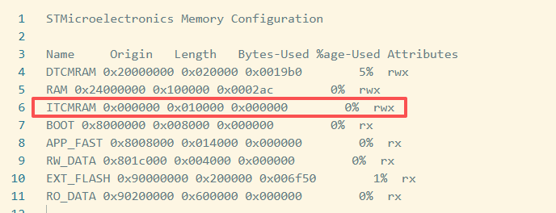

# STM32H7_Arm2D


### Memory Map

```Plaintext
	 Address          Memory Structure (Size)                  		Detail Partition               Address
  [0xFFFFFFFF] +---------------------------------------+---------------------------------------+
               |                                       |									   |
  0x9080_0000  +---------------------------------------+---------------------------------------+ 0x9080_0000
               |                                       |         Read_Only_Data (6144K)        |
               |         External_FLASH (8192K)        +---------------------------------------+ 0x9020_0000
               |                                       |           Application (2048K)         |
  0x9000_0000  +---------------------------------------+---------------------------------------+ 0x9000_0000
               |            Reserved/Unused            |            Reserved/Unused            |
  0x2410_0000  +---------------------------------------+---------------------------------------+
               |             AXI_SRAM3 (384K)          |									   |
  0x240A_0000  +---------------------------------------+---------------------------------------+
               |             AXI_SRAM2 (384K)          |									   |
  0x2404_0000  +---------------------------------------+---------------------------------------+
               |             AXI_SRAM1 (256K)          |									   |
  0x2400_0000  +---------------------------------------+---------------------------------------+
               |                Reserved               |                                       |
  0x2002_0000  +---------------------------------------+---------------------------------------+
               |             DTCM_RAM (128K)           |                                       |
  0x2000_0000  +---------------------------------------+---------------------------------------+
               |                Reserved               |									   |
  0x1FF2_0000  +---------------------------------------+---------------------------------------+
               |            System_RAM (128K)          |									   |
  0x1FF0_0000  +---------------------------------------+---------------------------------------+
               |                Reserved               |									   |
  0x0802_0000  +---------------------------------------+---------------------------------------+ 0x0802_0000
               |                                       |          Read_Write_Data (16K)        |
               |                                       +---------------------------------------+ 0x0801_C000
               |         Internal_FLASH (128K)         |          App_Fast_Code (80K)          |
               |                                       +---------------------------------------+ 0x0800_8000
               |                                       |               Boot (32K)              |
  0x0800_0000  +---------------------------------------+---------------------------------------+ 0x0800_0000
               |                Reserved               |									   |
  0x0001_0000  +---------------------------------------+---------------------------------------+
               |              ITCM_RAM (64K)           |									   |
  0x0000_0000  +---------------------------------------+---------------------------------------+
```


### COPY VECTOR TABLE TO SRAM

```ld
  /* The startup code goes first into FLASH */
    /* used by the startup to initialize vector table */
  _sivtor = LOADADDR(.isr_vector);
  .isr_vector :
  {
    . = ALIGN(4);
    _svtor = .;
    KEEP(*(.isr_vector)) /* Startup code */
    . = ALIGN(4);
    _evtor = .; 
  } >RAM AT> EXT_FLASH
```


```assembly
/* Copy the vector segment from flash to SRAM */
  ldr r0, =_svtor
  ldr r1, =_evtor
  ldr r2, =_sivtor
  movs r3, #0 
  b LoopCopyVtorInit

CopyVtorInit:
  ldr r4, [r2, r3]
  str r4, [r0, r3]
  adds r3, r3, #4
    
LoopCopyVtorInit:
  adds r4, r0, r3
  cmp r4, r1
  bcc CopyVtorInit
```


# DMA2D

`480*800*2 = 768000 `~750KB

RAM split two part, last 768KB use as GRAM.(AXI_SRAM2 & AXI_SRAM3)

RAM (xrw)           : ORIGIN = 0x24000000, LENGTH = 256K
GRAM (xrw)          : ORIGIN = 0x24040000, LENGTH = 768K


# ARM-2D

### Add submodules and update all submodules.

```shell
git submodule add https://github.com/ARM-software/Arm-2D.git Code/app/Arm-2D
git submodule add https://github.com/GorgonMeducer/perf_counter.git Code/app/perf_counter
git submodule update --init --recursive
```

### Add cmake for ARM-2D and perf_counter

Create CmakeLists.txt in cmake/arm2d and cmake/perf_counter directories for Arm-2D and perf_counter.

In the top CmakeLists.txt, add above libraries into your project.

```cmake
add_library(arm2d_includes INTERFACE)
target_include_directories(arm2d_includes INTERFACE
    ${CMAKE_CURRENT_SOURCE_DIR}/Middlewares/ST/ARM/DSP/Inc
    ${CMAKE_CURRENT_SOURCE_DIR}/Arm-2D_Port/config
)

set(ARM2D_HELPER ON)
set(ARM2D_LCD_PRINTF ON)
set(ARM2D_CONTROLS ON)

set(CMSISCORE "${CMAKE_SOURCE_DIR}/Drivers/CMSIS" CACHE STRING "Path to CMSIS Core")
# set(CMSISCORE "${CMAKE_SOURCE_DIR}/Drivers/CMSIS" CACHE STRING "Path to CMSIS Core" FORCE)
add_compile_definitions(__PERF_COUNTER__)  


add_subdirectory(cmake/perf_counter)
add_subdirectory(cmake/arm2d)

# Special optization for Arm-2D library
if(CMAKE_BUILD_TYPE STREQUAL "Debug")
    target_compile_options(ARM2D PRIVATE -O3 -ffast-math -g0)
else()
    target_compile_options(ARM2D PRIVATE -O3)
endif()

target_link_libraries(ARM2D PUBLIC arm2d_includes)


# Add linked libraries
target_link_libraries(${CMAKE_PROJECT_NAME}
    stm32cubemx
    # Add user defined libraries
    ARM2D
    perf_counter
)
```


### Add DSP Library

Arm-2D depend on DSP Library, so we need add DSP in this project.

~~Install STM32 X-CUBE-ALGOBUILD pack and then selected DSP Library in STM32CubeMX~~(Detail in Problems #3)

**DO NOT** use a folder named **`Middlewares`** for your own CMSIS-DSP library. If you use libraries from STM32CubeMX, the tool may overwrite or delete your custom files in that directory. 

### Add CMSIS-DSP

`git submodule add https://github.com/ARM-software/CMSIS-DSP.git`


```CMAKE
add_library(arm2d_includes INTERFACE)
target_include_directories(arm2d_includes INTERFACE
    # ${CMAKE_CURRENT_SOURCE_DIR}/Middlewares/ST/ARM/DSP/Inc
    ${CMAKE_CURRENT_SOURCE_DIR}/CMSIS-DSP/Include  #include arm_math.h
    ${CMAKE_CURRENT_SOURCE_DIR}/Arm-2D_Port/config
)

add_subdirectory(CMSIS-DSP)

# Add linked libraries
target_link_libraries(${CMAKE_PROJECT_NAME}
    # Add user defined libraries
    ARM2D
    CMSISDSP       # DSP runtime for math functions used by ARM2D helper
    perf_counter
    stm32cubemx
)
```


### ARM2D Init

add dwt related code

```C
bool check_dwt_enabled(void)  
{  
    // 检查 Debug Exception and Monitor Control Register  
    uint32_t demcr = CoreDebug->DEMCR;  
    bool debug_enabled = (demcr & CoreDebug_DEMCR_TRCENA_Msk) != 0;  
      
    // 检查 DWT Control Register  
    uint32_t dwt_ctrl = DWT->CTRL;  
    bool dwt_enabled = (dwt_ctrl & DWT_CTRL_CYCCNTENA_Msk) != 0;  
      
    // printf("DEMCR: 0x%08lX (TRCENA=%s)\r\n",   
    //        demcr, debug_enabled ? "ON" : "OFF");  
    // printf("DWT_CTRL: 0x%08lX (CYCCNTENA=%s)\r\n",   
    //        dwt_ctrl, dwt_enabled ? "ON" : "OFF");  
      
    return debug_enabled && dwt_enabled;  
}

void enable_dwt(void)  
{  
    // 启用 Debug Exception and Monitor Control Register  
    CoreDebug->DEMCR |= CoreDebug_DEMCR_TRCENA_Msk;  
      
    // 启用 DWT cycle counter  
    DWT->CTRL |= DWT_CTRL_CYCCNTENA_Msk;  
      
    // 重置计数器  
    DWT->CYCCNT = 0;  
      
    // printf("DWT enabled\r\n");  
}
```


init perf_counmter and ARM2D

```C
if(check_dwt_enabled() ==  false)
  {
    enable_dwt();
  }
  perfc_init(true);
  arm_irq_safe 
  {
    arm_2d_init();
  }

  /* initialize the display adapter 0 service */
  disp_adapter0_init();
```


Call  disp_adapter0_task() in main loop.

```C
tResult = disp_adapter0_task();
```


and do not forget add perf_counter's systick handler in your SysTick_Handler()

```
void SysTick_Handler(void)
{
  /* USER CODE BEGIN SysTick_IRQn 0 */

  /* USER CODE END SysTick_IRQn 0 */
  HAL_IncTick();
  /* USER CODE BEGIN SysTick_IRQn 1 */
  user_code_insert_to_systick_handler();
  /* USER CODE END SysTick_IRQn 1 */
}
```


On STM32H7B0, we use *LCD Direct Mode*, so __DISP0_CFG_ENABLE_3FB_HELPER_SERVICE__ in arm_2d_disp_adapter_0.h need set to 1

```C
// <q>Enable the helper service for 3FB (LCD Direct Mode)
// <i> You can select this option when your LCD controller supports direct mode
#ifndef __DISP0_CFG_ENABLE_3FB_HELPER_SERVICE__
#   define __DISP0_CFG_ENABLE_3FB_HELPER_SERVICE__                 1
#endif
```


`IMPL_PFB_ON_DRAW(__pfb_draw_handler)` define the content show in display

```C
static
IMPL_PFB_ON_DRAW(__pfb_draw_handler)
{
    ARM_2D_PARAM(pTarget);
    ARM_2D_PARAM(ptTile);

    arm_2d_canvas(ptTile, __top_container) {
    
#if __DISP0_CFG_COLOR_SOLUTION__ != 1              /* as long as it is not monochrome */
        arm_2d_align_centre(__top_container, 100, 100) {
            draw_round_corner_box(  ptTile,
                                    &__centre_region,
                                    GLCD_COLOR_BLACK,
                                    64);
        }
#endif

        busy_wheel2_show(ptTile, bIsNewFrame);
    }

    arm_2d_op_wait_async(NULL);

    return arm_fsm_rt_cpl;
}
```

After that, compile and download execute file to MCU， and then we can see a busy wheel show in LCD.


# Problems

1. `.ARM.exidx` limit range in ± 1G， limit place code in internal flash(0x0800_8000) and external flash(0x9000_0000).

   ```shell
   [build] ld.lld: error: <internal>:(.ARM.exidx+0x8): relocation R_ARM_PREL31 out of range: 1811987350 is not in [-1073741824, 1073741823]
   ```

   **Solution**

   discard in link file, maybe not a good idea(**I'm not familiar with this**). then we can place codes in internal flash when it need fast speed.

   ```ld
     /DISCARD/ :
     {
       libc.a:* ( * )
       libm.a:* ( * )
       libgcc.a:* ( * )
       *(.ARM.exidx*)   /* Remove ARM exception unwinding index table */
       *(.ARM.extab*)   /* Remove ARM exception unwinding instructions */
     }
   ```

1. When you select the DSP library in STM32CubeMX’s code generation tool, it does **not** copy the pre-compiled library file (`arm_cortexM7l_math.a`) or the DSP library source files to the user project.

   I'm not sure if this is an intended **feature** or a **bug**. The same problem has **appeared** on both Windows and macOS (tested with STM32CubeMX versions 6.16.0 and 6.17.0).
   
   Therefore, the workaround is to **build the CMSIS-DSP library yourself**. You can find the source files on GitHub, or copy them from the STM32CubeMX library installation path.

   >https://github.com/ARM-software/CMSIS-DSP

   


# Bugs

1. In the VSCode STM32Cube Build Analyzer (v1.1.0) extension, there appear to be display errors regarding the **ITCM section** (address 0x0000_0000). The extension includes sections such as `.ARM.attributes` and `.symtab` in its usage calculation **which should be excluded**, leading to a reported usage higher than the actual amount. However, the ITCM section usage is **correctly reflected** in the `.map` file.

   

2. LCD screen abnormalities

   The output speed of the pins used by the LTDC must be configured to **Very High**; otherwise, screen corruption may occur after a period of operation.

3. 


# TODOS

- [x] External flash loader

- [x] boot

- [ ] application
  - [x] Uart async ring buffer
    - [x] Transmit use software ring buffer (It doesn't seem to work very well when sending large amounts of data... 
      will fix it future if necessary )
    
    - [x] Receive use DMA circular mode
    
  - [x] Button
  
  - [ ] ~~LEDs control~~
  
  - [ ] ARM2D
  
  - [ ] 
  


